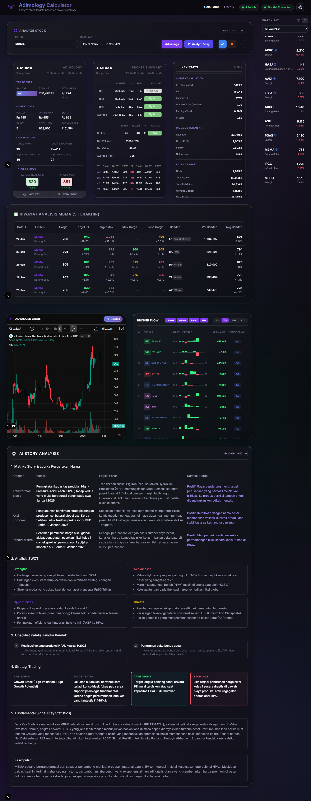

# Adimology - Kalkulator Target Saham

> [!CAUTION]
> **PERINGATAN KEAMANAN**: Jangan pernah membagikan URL aplikasi Netlify Anda secara publik. Aplikasi ini melakukan sinkronisasi token sesi Stockbit Anda ke database. Jika URL bocor, orang lain dapat menyalahgunakan akses tersebut. Meski begitu, aplikasi ini tetap tidak bisa melakukan transaksi karena tidak bisa mengakses fitur PIN. Gunakan aplikasi ini hanya untuk penggunaan pribadi.

> [!IMPORTANT]
> **DISCLAIMER & TANGGUNG JAWAB**: Dengan menginstal dan menggunakan aplikasi ini, Anda menyatakan sadar dan setuju bahwa aplikasi ini akan menggunakan token sesi Stockbit Anda untuk keperluan sinkronisasi data. Pengguna memahami sepenuhnya cara kerja aplikasi ini dan membebaskan pengembang dari segala tuntutan hukum atau kerugian yang mungkin timbul. Pengembang tidak bertanggung jawab atas penyalahgunaan akses jika URL aplikasi Anda diketahui oleh pihak lain.

---

💡 **Credit Rumus**: Algoritma dan rumus analisis dalam aplikasi ini didasarkan pada metodologi dari **[Adi Sucipto](https://www.instagram.com/adisuciipto/)**.

---

## Changelog

### v0.4.0 (2026-02-23)
- **High-Fidelity Copy Image**: Migrasi dari `html2canvas` ke `html-to-image` untuk hasil capture yang lebih tajam (HD) dan akurat.
- **Glassmorphism Support**: Perbaikan masalah warna kusam/abu-abu saat capture dengan menonaktifkan backdrop-filter sementara selama proses pengambilan gambar.
- **Transparent Corners**: Optimalisasi capture spesifik pada elemen card untuk menghasilkan pojok yang transparan (rounded) saat di-paste ke aplikasi pihak ketiga (WhatsApp/Telegram).
- **Clean Capture**: Penambahan fitur filter otomatis untuk menyembunyikan tombol aksi footer dari hasil gambar copy.

### v0.3.3 (2026-02-22)
- **Password Protection**: Implementasi keamanan akses aplikasi dengan proteksi password.
- **Session-based Unlocking**: Mekanisme akses satu kali per sesi.
- **Reset Documentation**: Panduan pemulihan akses melalui Supabase jika lupa password.

### v0.3.2 (2026-02-22)
- **Local Watchlist & Normalization**: Mengalihkan penyimpanan data watchlist dari Stockbit API ke database lokal (cache-first) dengan struktur database yang lebih efisien.
- **Status Indicator UI**: Pembaruan indikator status token dengan warna **Orange** untuk status "Expiring", serta pemindahan indikator proses fetching stockbit ke Navbar untuk mencegah *layout shifting*.
- **Spinner & Aesthetics**: Pembaruan gaya visual spinner menjadi transparan (arc-only) dan penyatuan status sinkronisasi *Watchlist* ke indikator global di Navbar.
- **Documentation Migration**: Memindahkan panduan instalasi lengkap ke Wiki (`docs/WIKI_DEPLOY_LOCAL.md` & `docs/WIKI_DEPLOY_CLOUD.md`) untuk menjaga agar README tetap ringkas.

### v0.3.1 (2026-02-19)
- **Responsive Navbar**: Implementasi menu hamburger untuk tampilan mobile, memindahkan indikator status dan toggle tema ke dalam sub-menu.
- **Card UI Fixes**: Perbaikan alignment logo/judul pada navbar dan penanganan nama sektor yang sangat panjang (elipsis) pada card ringkasan.
- **Scroll Optimization**: Menonaktifkan vertical scroll pada `CompactResultCard` dan `BrokerSummaryCard` untuk menjaga konsistensi visual saat pengambilan screenshot/copy image.

### v0.3.0 (2026-02-16)
- **New Summary & Performance Dashboard**: Dasbor khusus untuk melacak performa emiten dalam jangka waktu tertentu (3, 5, 10, 20, 50 hari trading).
- **Hit Rate Analytics**: Kalkulasi otomatis "Hit Rate R1", "Hit Rate Max", dan "Total Hit Rate" berdasarkan riwayat analisis nyata.
- **Top 3 Bandar Tracking**: Menampilkan 3 broker paling aktif untuk setiap emiten, lengkap dengan jumlah kemunculan dan klasifikasi tipe (Whale, Smart Money, Retail, Mix).
- **Fix PDF Export Global**: Perbaikan bug di mana beberapa emiten terlewati pada "All Per Emiten PDF" serta memastikan filter diterapkan secara global (bukan hanya halaman aktif).
- **UI/UX Refinements**: Standarisasi ukuran font, peningkatan kontras warna label pada Dark Mode, dan optimalisasi layout kolom untuk keterbacaan data yang lebih baik.

### v0.2.0 (2026-02-15)
- **Advanced PDF Export**: Sistem pelaporan PDF baru yang lebih informatif, mencakup:
  - Format portrait yang dioptimalkan (muat 20 baris per halaman).
  - Ringkasan statistik agregat (Hit R1, Hit Max, Avg Bandar Plus/Minus).
  - Ringkasan frekuensi Bandar per emiten.
  - Grafik performa visual (dot tracking) terintegrasi dalam PDF.
- **Revamp UI Tabel Riwayat**: Pembaruan gaya tombol "Solid-Btn" yang lebih premium dan konsisten di seluruh aplikasi, serta perbaikan visibilitas elemen pada Dark Mode.
- **Sinkronisasi Format Laporan**: Menyamakan format output antara "Filtered PDF" dan "Per Emiten PDF" untuk konsistensi data.

---

## Fitur Utama

- **Analisis Target**: Menghitung target harga "Realistis (R1)" dan "Maksimal" berdasarkan rata-rata harga pembelian broker (Avg Bandar).
- **Summary & Performance Dashboard**: Melacak hit rate target emiten dan dominasi bandar dalam rentang waktu tertentu.
- **Data Terintegrasi Stockbit**: Mengambil data transaksi broker summary.
- **History & Watchlist**: Menyimpan riwayat analisis untuk dipantau di kemudian hari.
- **Sync Watchlist & Hapus Otomatis**: Menampilkan watchlist langsung dari akun Stockbit termasuk fungsi delete.
- **Tracking Real Harga**: Otomatis memperbarui harga riil di hari bursa berikutnya untuk memverifikasi target.
- **Sistem Background Job & Retry**: Pemantauan status background job (analisis otomatis) dengan tombol **Retry** untuk menjalankan ulang job yang gagal.
- **Advanced Charts (TradingView & Chartbit)**:
  - Integrasi grafis dengan **Chartbit**.
  - Integrasi **TradingView Advanced Chart** dengan indikator RSI dan Oversold untuk konfirmasi sinyal Buy/Sell. Register ke https://www.tradingview.com/ untuk bisa melihat grafiknya.
- **Filter Flag & Watchlist**: Filter cepat berdasarkan flag emiten dan watchlist untuk mempermudah pemantauan portfolio.
- **Ringkasan Broker (Top 1, 3, 5)**: Visualisasi kekuatan akumulasi vs distribusi broker.
- **AI Story Analysis**: Analisis berita dan sentimen pasar menggunakan AI (Gemini) untuk merangkum story, SWOT, dan katalis emiten secara instan.
- **Multi-Version Analysis**: Menyimpan dan menampilkan riwayat analisis AI sebelumnya sehingga Anda bisa melacak perubahan narasi pasar dari waktu ke waktu.
- **Export to PDF**: Unduh laporan riwayat analisis dalam format PDF yang rapi.
- **Password Protection**: Proteksi keamanan akses aplikasi untuk menjaga privasi data dan token sesi Anda.

---

## Tech Stack

- **Frontend**: [Next.js 15 (App Router)](https://nextjs.org/), React 19, Tailwind CSS 4.
- **Backend/Database**: [Supabase](https://supabase.com/) (PostgreSQL).
- **Deployment**: [Netlify](https://www.netlify.com/) (dengan Netlify Functions & Scheduled Functions).
- **AI Engine**: [Google Gemini Pro](https://ai.google.dev/) dengan Google Search Grounding untuk data berita terkini.
- **Tools**: `jspdf`, `html-to-image`, & `html2canvas` untuk ekspor PDF dan capture image, `lucide-react` untuk ikon.

---

## Pilih Opsi Instalasi

Pilih salah satu opsi instalasi yang sesuai dengan kebutuhan Anda:

| | **OPSI A: CLOUD** | 💻 **OPSI B: LOKAL** |
|---|---|---|
| **Platform** | Netlify + Supabase | PC Lokal + Supabase |
| **Akses** | Dari mana saja via URL | Hanya dari PC Anda |
| **Scheduled Functions** | ✅ Otomatis jalan | ❌ Manual trigger |
| **Biaya** | Free tier tersedia | Gratis (self-hosted) |
| **Cocok untuk** | Penggunaan harian | Development/testing |

---

# OPSI A: Deploy ke Cloud (Netlify + Supabase)

Opsi ini direkomendasikan untuk penggunaan harian karena aplikasi akan berjalan secara otomatis di cloud dan dapat diakses dari mana saja.

👉 **[Lihat Panduan Deploy Cloud Selengkapnya](https://github.com/bhaktiutama/adimology/wiki/Deploy-Cloud)**

---

# OPSI B: Instalasi Lokal (PC + Supabase)

Opsi ini cocok untuk pengembangan atau jika Anda hanya ingin menjalankan aplikasi di komputer sendiri.

👉 **[Lihat Panduan Instalasi Lokal Selengkapnya](https://github.com/bhaktiutama/adimology/wiki/Deploy-Local)**

---

## Troubleshooting
 
👉 **[Punya masalah? Lihat Checkpoint Troubleshooting](https://github.com/bhaktiutama/adimology/wiki/Checkpoint)**

---

## Referensi Environment Variables

| Variable | Cloud | Lokal | Deskripsi |
|----------|:-----:|:-----:|-----------|
| `NEXT_PUBLIC_SUPABASE_URL` | ✅ | ✅ | URL project Supabase |
| `NEXT_PUBLIC_SUPABASE_ANON_KEY` | ✅ | ✅ | Anon key Supabase |
| `CRON_SECRET` | ✅ | ❌ | Secret untuk scheduled functions |
| `GEMINI_API_KEY` | ✅ | ✅ | API Key Google AI Studio |
| `STOCKBIT_JWT_TOKEN` | ❌ | ⚠️ | Fallback token manual |

---

## Lisensi

Aplikasi ini dilisensikan di bawah MIT License.

Copyright (c) 2026 Bhakti Utama.

Izin diberikan, secara gratis, kepada siapa pun yang mendapatkan salinan perangkat lunak ini untuk menggunakannya tanpa batasan, termasuk hak untuk menggunakan, menyalin, memodifikasi, menggabungkan, menerbitkan, mendistribusikan, menyisipkan lisensi, dan/atau menjual salinan perangkat lunak ini. 

Proyek ini dibuat untuk tujuan edukasi dan penggunaan pribadi. Pastikan untuk mematuhi ketentuan penggunaan layanan pihak ketiga yang digunakan.
